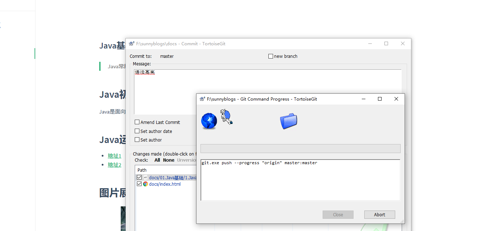
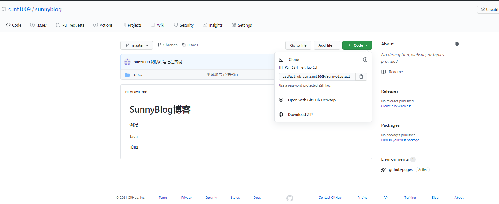

### Java基本语法介绍

> Java常用语法简介

## Java初始

Java是面向过程语言

## Java运算原理

- [地址1](https://www.baidu.com)212
- [地址2](https://www.baidu.comn)

## 图片展示

图片展示

## 语法样式

- Java语法

```java
package com.test.job;

import lombok.extern.slf4j.Slf4j;
import org.springframework.beans.factory.annotation.Autowired;
import org.springframework.scheduling.annotation.Scheduled;
import org.springframework.stereotype.Component;

@Component
@Slf4j
public class AutoReportJob {
	@Autowired
	private MailService mailService;
	@Autowired
	private OnlineReportService onlineReportService;
	@Autowired
	private OrderService orderService;
	@Autowired
	private CommonService commonService;

	/**
	 * 发送邮件
	 */
	//@Scheduled(cron = "0 */1 * * * ?")
	public void executeNetConnect() throws Exception {
		log.info("执行测试发送邮件:" + DateUtil.getCurrentDate());
		mailService.sendMail("wnst1990@163.com", "suntan@test.com", "电商报表统计", "本月电商报表明细信息");
	}

	/**
	 * 物流生产订单每天定时发送
	 * @throws Exception
	 */
	//@Scheduled(cron = "0 55 23 * * ?")
	public void executeSend() throws Exception {
		log.info("执行报表统计邮件发送start:" + DateUtil.getCurrentDate());
		onlineReportService.exportReport();
		log.info("执行报表统计邮件发送end:" + DateUtil.getCurrentDate());
	}

	/**
	 * 订单中心app业务明细报表每天统计入库
	 * @throws Exception
	 */
	@Scheduled(cron = "0 0 3 * * ? ")
	public void asyncData() {
		try {
			log.info("---------------->定时任务同步APP数据开始:" + DateUtil.getCurrentDate());
			orderService.asyncAppData();
		} catch (Exception e) {
			e.printStackTrace();
			commonService.sendExceptionMsg(e);
			log.error("------------------>定时任务同步APP数据异常:" + e.getMessage());
		}
	}


	/**
	 * 订单中心查询数据同步表
	 * //每天凌晨六点执行 "0 0 6 * * ? "
	 * @throws Exception
	 */
	@Scheduled(cron = "0 0 6 * * ? ")
	public void syncQueryData() {
		try {
			log.info("---------------->定时任务同步查询数据:" + DateUtil.getCurrentDate());
			orderService.syncQueryData();
		} catch (Exception e) {
			e.printStackTrace();
			commonService.sendExceptionMsg(e);
			log.error("------------------>定时任务同步查询数据异常:" + e.getMessage());
		}
	}
	
}

```


- SQL语法

```sql
SELECT T.ORDER_ID,
       T3.PROP_VALUE,
       T.AREA_CODE,
       T.EPARCHY_CODE,
       T.COUNTY_CODE,
       T5.CARD_PHOTO_A,
       T5.CARD_PHOTO_B,
       T5.CARD_PHOTO_HAND,
       SYSDATE
  FROM TF_ORD_MAIN T
 INNER JOIN TF_ORD_PRODUCTION_MAIN T2
    ON T.ORDER_ID = T2.ORDER_ID
 INNER JOIN TF_ORD_PRODUCTION_ITEM T3
    ON T3.PRODUCTION_ORDER_ID = T2.PRODUCTION_ORDER_ID
 INNER JOIN TF_ORD_PROD_MAIN T4
    ON T4.ORDER_ID = T.ORDER_ID
 INNER JOIN TF_ORD_CUSTINFO T5
    ON T5.PRODUCT_ORDER_ID = T4.PRODUCT_ORDER_ID
 INNER JOIN TF_ORD_FLOW_MAIN T6
    ON T6.ORDER_ID = T.ORDER_ID
 WHERE 1 = 1
   AND T.DELIVERY_TYPE = 'DT05'
   AND NVL(T5.CARD_PHOTO_A, '0') != '0'
   AND NVL(T5.CARD_PHOTO_B, '0') != '0'
   AND NVL(T5.CARD_PHOTO_HAND, '0') != '0'
   AND T6.FLOW_DEF_ID = 'ord_4g_prod_logis'
   AND T.ORDER_STATUS != '0060'
   AND T3.PROPT_CODE = 'EssOrderId'
   AND T.IN_TIME >= TO_DATE('2020-02-25 00:00:00', 'yyyy-mm-dd hh24:mi:ss')
   AND NOT EXISTS (SELECT T6.ORDER_ID
          FROM TF_ORD_SYNC_PHOTO T6
         WHERE T6.ORDER_ID = T.ORDER_ID);
```

- JS语法

```javascript
function productDataInit(productData) {
	var tableStr = '';
	tableStr += '<table border="1" bordercolor="#d6d6d6" style="margin-left: 0px;">';
	tableStr += '<tr>';
	tableStr += '<th style="text-align: center;width:8%;">客户名称</th>';
	tableStr += '<th style="text-align: center;width:9%;">号码</th>';
	tableStr += '<th style="text-align: center;width:14%;">商品名称</th>';
	tableStr += '<th style="text-align: center;width:10%;">商城订单号</th>';
	tableStr += '<th style="text-align: center;width:8%;">订单状态</th>';
	tableStr += '</tr>';
	tableStr += '<tr>';
	tableStr += '<td style="text-align: center; padding-top: 0px; padding-bottom: 0px;white-space: normal;">'+productData.custName+'</td>';
	tableStr += '<td style="text-align: center; padding-top: 0px; padding-bottom: 0px;white-space: normal;">'+productData.goodsNum+'</td>';
	tableStr += '<td style="text-align: center; padding-top: 0px; padding-bottom: 0px;white-space: normal;">'+productData.goodsName+'</td>';
	tableStr += '<td style="text-align: center; padding-top: 0px; padding-bottom: 0px;white-space: normal;">'+productData.extGoodsId+'</td>';
	tableStr += '<td style="text-align: center; padding-top: 0px; padding-bottom: 0px;white-space: normal;" class="goodsStateTd">'+productData.goodsStateName+'</td>';
	tableStr += '</tr>';
	tableStr += '</table>';
	tableStr += '<div style="padding-top:5px;">';
	tableStr += '生产结果：<span class="required productResultMsg"></span>';
	tableStr += '</div>';
	$(".productDataTable").html("");
	$(".productDataTable").html(tableStr);
	thisProductData = productData;
	// 生产进度条和生产按钮初始化
	productFlowAndOperBtnInit(productData);
}
```

## 图片粘贴



## 提交测试123123213

