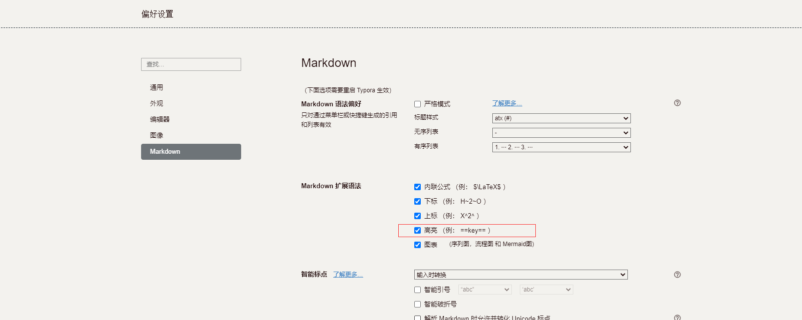

# Typro使用教程

## 简介

Typora是一款轻便简洁的Markdown编辑器，支持即时渲染技术，这也是与其他Markdown编辑器最显著的区别。即时渲染使得你写Markdown就想是写Word文档一样流畅自如，不像其他编辑器的有编辑栏和显示栏。

## 下载地址

[点击下载Typora](https://wws.lanzous.com/i1kebmribsb)

## 常用快捷键

- 加粗 **Ctrl+B**

- 标题 **Ctrl+对应的数字代表积极标题**  Ctrl+1  一级标题  Ctrl+2  二级标题...

- 插入链接 **Ctrl+K**

- 插入代码块 **Ctrl+Shift+K**

- 行内代码块(三个反引号) **```**

- 插入图片 **Ctrl+Shift+I**

- 无序列表 **Ctrl+Shift+]**

- 有序列表 **Ctrl+Shift+[**

- 增加列表缩进  **Ctrl+]**

- 减少缩进  **Ctrl+[**

- 引用文字   **> + 空格 +需要引用的文字**

- *斜体* **Ctrl+I**

- ~~删除线~~ **Alt+Shift+5**

- <u>下划线</u> **Ctrl+U**

- 表情符号 **冒号+对应表情**     :smile_cat:

- 高亮显示 需要在设置中开启 两个等号之间的内容都会高亮显示 ==高亮文本==

  

- 

## 快捷键使用

- 引用文字

> Typora是一款轻便简洁的Markdown编辑器，支持即时渲染技术

- 文字加粗

  **Typora是一款轻便简洁的Markdown编辑器，支持即时渲染技术**

- 插入链接 [跳转到百度](https://www.baidu.com)

- 插入图片


- 插入表格

>  创建方式|学号|年龄|性别|按回车即可创建，新增一行同时按Ctrl+回车
>
> 或者通过Ctrl+T快捷创建

|    学号     | 年龄 | 性别 |
| :---------: | ---- | ---- |
|   123123    | 12   | 男   |
|   312321    | 19   | 男   |
| 43232243423 | 16   | 女   |
|    3123     | 21   | 男   |

- 代码块

```java
/**
     * Description 根据键值进行解密
     * @param data
     * @param key  加密键byte数组
     * @return
     * @throws Exception
     */
    private static byte[] decrypt(byte[] data, byte[] key) throws Exception {
        // 生成一个可信任的随机数源
        SecureRandom sr = new SecureRandom();

        // 从原始密钥数据创建DESKeySpec对象
        DESKeySpec dks = new DESKeySpec(key);

        // 创建一个密钥工厂，然后用它把DESKeySpec转换成SecretKey对象
        SecretKeyFactory keyFactory = SecretKeyFactory.getInstance("DES");
        SecretKey securekey = keyFactory.generateSecret(dks);

        // Cipher对象实际完成解密操作
        Cipher cipher = Cipher.getInstance("DES");

        // 用密钥初始化Cipher对象
        cipher.init(Cipher.DECRYPT_MODE, securekey, sr);

        return cipher.doFinal(data);
    }
```

- 分割线 输入***或者---回车

***

---

- 目录 输入[toc]回车

