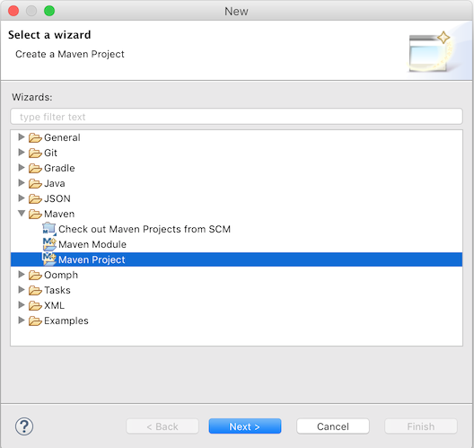
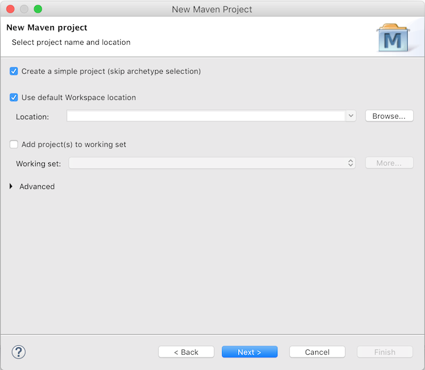

### 1.Flowable介绍
​		Flowable 是一个用 Java 编写的轻量级业务流程引擎。Flowable 流程引擎允许您部署 BPMN 2.0流程定义(用于定义流程的行业 XML 标准)、创建这些流程定义的流程实例、运行查询、访问活动或历史流程实例和相关数据，以及更多内容。本节将通过示例逐步介绍各种概念和 api，您可以在自己的开发机器上遵循这些概念和 api

​		在将其添加到应用程序/服务/体系结构时，可流动性非常灵活。您可以通过包含 Flowable 库将引擎嵌入到应用程序或服务中，Flowable 库可以作为 JAR 使用。由于它是一个 JAR，您可以轻松地将它添加到任何 Java 环境中: javase; servlet 容器，如 Tomcat 或 Jetty、 Spring; javaee 服务器，如 JBoss 或 WebSphere，等等。或者，您可以使用 Flowable REST API 通过 HTTP 进行通信。还有一些可流动的应用程序(Flowable Modeler，Flowable Admin，Flowable IDM 和 Flowable Task) ，它们为处理流程和任务提供了开箱即用的示例 ui。

​		所有设置 Flowable 的方法的共同点是核心引擎，它可以被看作是一组服务的集合，这些服务公开了用于管理和执行业务流程的 api。下面的各种教程首先介绍如何设置和使用这个核心引擎。之后的章节将以前面章节中获得的知识为基础。

- 第一部分展示了如何以尽可能简单的方式运行 Flowable: 一个只使用 javase 的常规 Java 主程序。这里将解释许多核心概念和 api。
- Flowablerestapi 部分展示了如何通过 REST 运行和使用相同的 API。

### 2.流程与活动

> Flowable 是 Activiti (Alfresco 的注册商标)的一个分支。在以下所有部分中，您将注意到包名称、配置文件等使用可流动的。

### 3.建立一个入门级应用

#### 3.1.创建流程引擎

> 在第一个教程中，我们将构建一个简单的示例，演示如何创建 Flowable 流程引擎，介绍一些核心概念，并演示如何使用 API。屏幕截图显示 Eclipse，但是任何 IDE 都可以工作。我们将使用 Maven 获取 Flowable 依赖项并管理构建，但是同样地，任何其他选项也可以工作(Gradle、 Ivy 等等)。

**我们将构建的示例是一个简单的假日请求过程:**

- 员工要求多休几天假
- 经理要么批准要么拒绝请求
- 我们将在一些外部系统中模拟注册请求，然后向员工发送带有结果的电子邮件

**具体操作步骤如下**：

- 首先，我们通过 File → New → Other → Maven Project 创建一个新的 Maven 项目




- 在下一个屏幕中，我们检查“ create a simple project (跳过原型选择)”



- 然后填写一些“组 Id”和“ Artifact Id”:


**现在我们有了一个空的 Maven 项目，我们将在其中添加两个依赖项:**

- 流程引擎，它允许我们创建一个 ProcessEngine 对象并访问 Flowable api。

> 在这个例子中是一个内存数据库，h 2，因为 Flowable 引擎在运行流程实例时需要一个数据库来存储执行和历史数据。请注意，H2依赖项包括数据库和驱动程序。如果您使用另一个数据库(例如 PostgresQL、 MySQL 等等) ，则需要添加特定的数据库驱动程序依赖项。

- 将以下内容添加到 pom.xml 文件中:

```xml
<dependencies>
  <dependency>
    <groupId>org.flowable</groupId>
    <artifactId>flowable-engine</artifactId>
    <version>6.6.0</version>
  </dependency>
  <dependency>
    <groupId>com.h2database</groupId>
    <artifactId>h2</artifactId>
    <version>1.3.176</version>
  </dependency>
</dependencies>
```

> 如果由于某种原因未能自动检索到相关 jar 文件，您可以右键单击该项目并选择“ Maven → Update Project”来强制手动刷新(但通常不需要这样做)。在项目中，在“ Maven Dependencies”下，您现在应该看到可流动引擎和各种其他(可传递的)依赖项。

- 创建一个新的 Java 类，并添加一个常规的 Java main 方法:

```java
package org.flowable;

public class HolidayRequest {

  public static void main(String[] args) {

  }

}
```

> 我们需要做的第一件事是实例化一个 ProcessEngine 实例。这是一个线程安全对象，通常在应用程序中只需实例化一次。ProcessEngineConfiguration 实例创建了一个 ProcessEngine，它允许您配置和调整流程引擎的设置。ProcessEngineConfiguration 通常是使用配置 XML 文件创建的，但是(正如我们在这里所做的)您也可以通过编程方式创建它。ProcessEngineConfiguration 需要的最小配置是一个到数据库的 JDBC 连接:

```java
package org.flowable;

import org.flowable.engine.ProcessEngine;
import org.flowable.engine.ProcessEngineConfiguration;
import org.flowable.engine.impl.cfg.StandaloneProcessEngineConfiguration;

public class HolidayRequest {

  public static void main(String[] args) {
    ProcessEngineConfiguration cfg = new StandaloneProcessEngineConfiguration()
      .setJdbcUrl("jdbc:h2:mem:flowable;DB_CLOSE_DELAY=-1")
      .setJdbcUsername("sa")
      .setJdbcPassword("")
      .setJdbcDriver("org.h2.Driver")
      .setDatabaseSchemaUpdate(ProcessEngineConfiguration.DB_SCHEMA_UPDATE_TRUE);

    ProcessEngine processEngine = cfg.buildProcessEngine();
  }

}
```

> 在上面的代码中，第10行创建了一个独立的配置对象。这里的“ standalone”指的是这样一个事实，即引擎完全由自己创建和使用(而不是在 Spring 环境中使用 SpringProcessEngineConfiguration 类)。在第11行到第14行，传递到内存中的 H2数据库实例的 JDBC 连接参数。重要: 请注意，这样的数据库在 JVM 重新启动后不会存在。如果您希望您的数据是持久性的，那么您需要切换到持久性数据库并相应地切换连接参数。在第15行，我们将一个标志设置为 true，以确保数据库模式在 JDBC 参数指向的数据库中不存在时被创建。另外，Flowable 附带了一组 SQL 文件，可用于手动创建所有表的数据库模式。

然后使用这个配置创建 ProcessEngine 对象(第17行)。你现在可以运行这个了。在 Eclipse 中最简单的方法是右键单击类文件并选择 Run As → Java Application:


应用程序运行时没有问题，但是控制台中没有显示有用的信息，只有一条消息指出日志记录没有正确配置:

> Flowable 内部使用 SLF4J 作为其日志框架。对于这个例子，我们将使用 log4j logger over SLF4j，因此在 pom.xml 文件中添加以下依赖项:

```xml
<dependency>
  <groupId>org.slf4j</groupId>
  <artifactId>slf4j-api</artifactId>
  <version>1.7.30</version>
</dependency>
<dependency>
  <groupId>org.slf4j</groupId>
  <artifactId>slf4j-log4j12</artifactId>
  <version>1.7.30</version>
</dependency>
```

Log4j 需要一个属性文件进行配置，添加一个 Log4j.properties 文件到 src/main/resources 文件夹，内容如下:

```properties
log4j.rootLogger=DEBUG, CA

log4j.appender.CA=org.apache.log4j.ConsoleAppender
log4j.appender.CA.layout=org.apache.log4j.PatternLayout
log4j.appender.CA.layout.ConversionPattern= %d{hh:mm:ss,SSS} [%t] %-5p %c %x - %m%n
```

重新运行应用程序。现在你应该可以看到关于引擎启动和数据库模式创建的信息性日志记录:


我们现在已经启动了一个进程引擎并准备启动。是时候为它提供进程了！

#### 3.2.部署流程定义

​		我们将构建的流程是一个非常简单的假日请求流程。Flowable 引擎期望过程定义为 BPMN 2.0格式，这是一个在业界被广泛接受的 XML 标准。用 Flowable 的术语来说，我们把它称为过程定义。从流程定义，可以启动许多流程实例。可以将流程定义视为流程的许多执行的蓝图。在这种特殊情况下，流程定义定义了请求假日所涉及的不同步骤，而一个流程实例匹配某个特定员工的假日请求。

​		BPMN 2.0是以 XML 的形式存储的，但它也有一个可视化部分: 它以标准的方式定义了每个不同步骤类型(人工任务、自动服务调用等)的表示方式，以及如何将这些不同步骤相互连接。通过这种方式，BPMN 2.0标准允许技术人员和业务人员以双方都能理解的方式就业务流程进行通信。

我们将使用的流程定义如下:

**这个过程应该是不言自明的，但为了清晰起见，让我们描述一下不同的部分:**

- 我们假设这个过程是通过提供一些信息开始的，比如员工姓名、请求的假期数量和描述。当然，这可以作为流程中单独的第一步进行建模。然而，通过将其作为流程的“输入数据”，流程实例只有在发出真正的请求时才能实际创建。在另一种情况下，用户可以改变主意并在提交之前取消，但是流程实例现在已经存在了。在某些场景中，这可能是有价值的信息(例如，根据业务目标，一个请求启动了多少次，但没有完成)。
- 左边的圆叫做 start 事件，它是流程实例的起点。
- 第一个矩形是用户任务。这是人类用户必须执行的流程中的一个步骤。在这种情况下，经理需要批准或拒绝请求。
- 根据管理员的决定，独占网关(带有十字形的菱形)将把流程实例路由到批准或拒绝路径。
- 如果获得批准，我们必须在某个外部系统中注册请求，然后再为原始雇员再次执行一个用户任务，将决定通知他们。当然，这可能会被一封电子邮件所取代。
- 如果被拒绝，员工会收到一封电子邮件，通知他们此事。
- 通常，这样的流程定义使用可视化建模工具进行建模，例如 Flowable Designer (Eclipse)或 Flowable Modeler (web 应用程序)。

但是，在这里，我们将直接编写 XML 以熟悉 BPMN 2.0及其概念。

> 与上图对应的 BPMN 2.0 XML 如下所示。请注意，这只是“过程部分”。如果您使用了图形化建模工具，那么底层的 XML 文件还包含描述图形化信息的“可视化”部分，例如流程定义的各个元素的坐标(所有图形化信息都包含在 XML 中的 BPMNDiagram 标记中，它是 definition 标记的子元素)。

将以下 XML 保存在 src/main/resources 文件夹中名为 holiday-request.bpmn20.XML 的文件中。

```xml
<?xml version="1.0" encoding="UTF-8"?>
<definitions xmlns="http://www.omg.org/spec/BPMN/20100524/MODEL"
  xmlns:xsi="http://www.w3.org/2001/XMLSchema-instance"
  xmlns:xsd="http://www.w3.org/2001/XMLSchema"
  xmlns:bpmndi="http://www.omg.org/spec/BPMN/20100524/DI"
  xmlns:omgdc="http://www.omg.org/spec/DD/20100524/DC"
  xmlns:omgdi="http://www.omg.org/spec/DD/20100524/DI"
  xmlns:flowable="http://flowable.org/bpmn"
  typeLanguage="http://www.w3.org/2001/XMLSchema"
  expressionLanguage="http://www.w3.org/1999/XPath"
  targetNamespace="http://www.flowable.org/processdef">

  <process id="holidayRequest" name="Holiday Request" isExecutable="true">

    <startEvent id="startEvent"/>
    <sequenceFlow sourceRef="startEvent" targetRef="approveTask"/>

    <userTask id="approveTask" name="Approve or reject request"/>
    <sequenceFlow sourceRef="approveTask" targetRef="decision"/>

    <exclusiveGateway id="decision"/>
    <sequenceFlow sourceRef="decision" targetRef="externalSystemCall">
      <conditionExpression xsi:type="tFormalExpression">
        <![CDATA[
          ${approved}
        ]]>
      </conditionExpression>
    </sequenceFlow>
    <sequenceFlow  sourceRef="decision" targetRef="sendRejectionMail">
      <conditionExpression xsi:type="tFormalExpression">
        <![CDATA[
          ${!approved}
        ]]>
      </conditionExpression>
    </sequenceFlow>

    <serviceTask id="externalSystemCall" name="Enter holidays in external system"
        flowable:class="org.flowable.CallExternalSystemDelegate"/>
    <sequenceFlow sourceRef="externalSystemCall" targetRef="holidayApprovedTask"/>

    <userTask id="holidayApprovedTask" name="Holiday approved"/>
    <sequenceFlow sourceRef="holidayApprovedTask" targetRef="approveEnd"/>

    <serviceTask id="sendRejectionMail" name="Send out rejection email"
        flowable:class="org.flowable.SendRejectionMail"/>
    <sequenceFlow sourceRef="sendRejectionMail" targetRef="rejectEnd"/>

    <endEvent id="approveEnd"/>

    <endEvent id="rejectEnd"/>

  </process>

</definitions>
```

- 第2行到第11行看起来有点令人生畏，但是几乎每个进程定义都是一样的。这是一种需要与 BPMN 2.0标准规范完全兼容的样板文件。
- 每一步(在 BPMN 2.0术语中，‘ activity’)都有一个 id 属性，在 XML 文件中给它一个唯一标识符。所有的活动也可以有一个可选的名称，当然，这增加了可视化图表的可读性。
- 活动通过序列流连接，序列流是可视图中的定向箭头。当执行一个流程实例时，执行将从开始事件流向下一个活动，遵循序列流。
- 离开独占网关的序列流(带有 x 的菱形形状)显然是特殊的: 两者都有一个以表达式形式定义的条件(见第25和32行)。当流程实例执行到达此网关时，将对条件进行计算，并执行第一个解析为 true 的条件。这就是排他性的含义: 只有一个被选中。当然，如果需要不同的路由行为，其他类型的网关也是可能的。
- 这里以表达式形式写的条件是 ${ approved } ，这是 ${ approved = = true }的简写形式。被批准的变量被称为程序变数。程序变数数据是与流程实例一起存储的持久性数据位，可以在流程实例的生存期内使用。在这种情况下，它确实意味着我们必须在流程实例中的某个特定点(当 manager 用户任务提交时，或者用 Flowable 术语来说，当任务完成时)设置这个程序变数，因为在流程实例启动时，它不是可用的数据。

**现在我们有了进程 BPMN 2.0 XML 文件，接下来需要将它“部署”到引擎中。部署流程定义意味着:**

- 流程引擎将 XML 文件存储在数据库中，因此可以在需要时进行检索
- 流程定义被解析为内部的可执行对象模型，这样流程实例就可以从它启动。
- 要将流程定义部署到 Flowable 引擎，需要使用 RepositoryService，它可以从 ProcessEngine 对象中检索。使用 RepositoryService，通过传递 XML 文件的位置并调用 deploy ()方法来实际执行它，从而创建一个新的 Deployment:

```java
RepositoryService repositoryService = processEngine.getRepositoryService();
Deployment deployment = repositoryService.createDeployment()
  .addClasspathResource("holiday-request.bpmn20.xml")
  .deploy();
```

- 现在，我们可以通过 API 查询流程定义来验证引擎是否知道该流程定义(并学习一些有关 API 的知识)。这是通过通过 RepositoryService 创建一个新的 processdefinittionquery 对象来完成的。

```java
ProcessDefinition processDefinition = repositoryService.createProcessDefinitionQuery()
  .deploymentId(deployment.getId())
  .singleResult();
System.out.println("Found process definition : " + processDefinition.getName());
```

#### 3.3.启动流程实例

我们现在已经将流程定义部署到流程引擎，因此可以使用这个流程定义作为“蓝图”来启动流程实例。

> 要启动流程实例，我们需要提供一些初始流程变量。通常，当某个进程被自动触发时，您将通过提供给用户的表单或通过 REST API 获得这些信息。在这个示例中，我们将保持它的简单性并使用 java.util。扫描器类简单地输入一些数据在命令行:

```java
Scanner scanner= new Scanner(System.in);

System.out.println("Who are you?");
String employee = scanner.nextLine();

System.out.println("How many holidays do you want to request?");
Integer nrOfHolidays = Integer.valueOf(scanner.nextLine());

System.out.println("Why do you need them?");
String description = scanner.nextLine();
```

接下来，我们可以通过 RuntimeService 启动一个流程实例。收集到的数据作为 java.util 传递。映射实例，其中键是稍后用于检索变量的标识符。使用键启动流程实例。此键匹配 BPMN 2.0 XML 文件中设置的 id 属性，在本例中为 holidayRequest。

> (注意: 除了使用键之外，稍后您将学习启动流程实例的许多方法)

```java
<process id="holidayRequest" name="Holiday Request" isExecutable="true">

RuntimeService runtimeService = processEngine.getRuntimeService();

Map<String, Object> variables = new HashMap<String, Object>();
variables.put("employee", employee);
variables.put("nrOfHolidays", nrOfHolidays);
variables.put("description", description);
ProcessInstance processInstance =
  runtimeService.startProcessInstanceByKey("holidayRequest", variables);
```

启动流程实例时，将创建一个执行并将其放入 start 事件中。从那里，这个执行遵循用于管理器批准的用户任务的序列流，并执行用户任务行为。此行为将在数据库中创建一个任务，稍后可以使用查询找到该任务。用户任务是一种等待状态，引擎将停止进一步执行任何操作，并返回 API 调用。

#### 3.4.事务性

​		在 Flowable，数据库事务在保证数据一致性和解决并发性问题方面起着至关重要的作用。在进行 flowableapi 调用时，默认情况下，所有内容都是同步的，并且是同一事务的一部分。这意味着，当方法调用返回时，事务将被启动并提交。

​		启动流程实例时，从流程实例的开始到下一个等待状态之间将有一个数据库事务。在本例中，这是第一个用户任务。当引擎到达这个用户任务时，状态被持久化到数据库，事务被提交，API 调用返回。

​		在 Flowable，当继续一个流程实例时，总会有一个数据库事务从前一个等待状态转移到下一个等待状态。一旦持久化，数据可以在数据库中保存很长时间，甚至可以保存数年，直到执行一个 API 调用，使流程实例更进一步。请注意，当流程实例处于这种等待状态，等待下一个 API 调用时，不会消耗计算或内存资源。

​		在这里的示例中，当第一个用户任务完成时，将使用一个数据库事务从用户任务通过独占网关(自动逻辑)到达第二个用户任务。或者直接走到另一条路的尽头。

#### 3.5.查询和完成任务

​		在一个更实际的应用程序中，将有一个用户界面，员工和管理人员可以在其中登录并查看他们的任务列表。有了这些，他们可以检查作为流程变量存储的流程实例数据，并决定他们想对任务做什么。在这个示例中，我们将通过执行通常位于驱动 UI 的服务调用后面的 API 调用来模拟任务列表。

​		我们还没有为用户任务配置任务。我们希望将第一个任务分配给“ managers”组，将第二个用户任务分配给假期的原始请求者。为此，在第一个任务中添加 candidateGroups 属性:

```xml
<userTask id="approveTask" name="Approve or reject request" flowable:candidateGroups="managers"/>
```

​		受让人属性为第二个任务，如下所示。请注意，我们并没有使用上面的 managers 值这样的静态值，而是使用了一个基于流程实例启动时所传递的程序变数的动态赋值:

```xml
<userTask id="holidayApprovedTask" name="Holiday approved" flowable:assignee="${employee}"/>
```

​		为了获得实际的任务列表，我们通过 TaskService 创建一个 TaskQuery，并将查询配置为只返回‘ managers’组的任务:

```java
TaskService taskService = processEngine.getTaskService();
List<Task> tasks = taskService.createTaskQuery().taskCandidateGroup("managers").list();
System.out.println("You have " + tasks.size() + " tasks:");
for (int i=0; i<tasks.size(); i++) {
  System.out.println((i+1) + ") " + tasks.get(i).getName());
}
```

使用任务标识符，我们现在可以获得特定的流程实例变量，并在屏幕上显示实际的请求:

```java
System.out.println("Which task would you like to complete?");
int taskIndex = Integer.valueOf(scanner.nextLine());
Task task = tasks.get(taskIndex - 1);
Map<String, Object> processVariables = taskService.getVariables(task.getId());
System.out.println(processVariables.get("employee") + " wants " +
    processVariables.get("nrOfHolidays") + " of holidays. Do you approve this?");
```

如果你运行这个程序，应该是这样的:


经理现在就可以**完成任务**了。在现实中，这通常意味着由用户提交一个表单。表单中的数据作为*流程变量*传递。在这里，我们在完成任务时传递带有’approved’变量（这个名字很重要，因为之后会在顺序流的条件中使用！）的map来模拟：

```java
boolean approved = scanner.nextLine().toLowerCase().equals("y");
variables = new HashMap<String, Object>();
variables.put("approved", approved);
taskService.complete(task.getId(), variables);
```

现在任务完成，并会在离开排他网关的两条路径中，基于’approved’流程变量选择一条。

#### 3.5.实现JavaDelegate

还有最后一块拼图没有完成: 我们还没有实现当请求被批准时执行的自动逻辑。在 BPMN 2.0 XML 中，这是一个服务任务，如上图所示:

```xml
<serviceTask id="externalSystemCall" name="Enter holidays in external system"
    flowable:class="org.flowable.CallExternalSystemDelegate"/>
```

实际上，这种逻辑可以是任何逻辑，从使用 HTTP REST 调用服务，到执行一些遗留代码调用，再到组织使用了几十年的系统。我们在这里不实现实际的逻辑，只是简单地记录处理过程。

创建一个新类(File → New → Class in Eclipse) ，填写 org.flowable 作为包名，CallExternalSystemDelegate 作为类名。让该类实现 org.flowable.engine.delegate。接口和执行方法:

```java
package org.flowable;

import org.flowable.engine.delegate.DelegateExecution;
import org.flowable.engine.delegate.JavaDelegate;

public class CallExternalSystemDelegate implements JavaDelegate {

    public void execute(DelegateExecution execution) {
        System.out.println("Calling the external system for employee "
            + execution.getVariable("employee"));
    }

}
```

当执行到达服务任务时，将实例化并调用 BPMN 2.0 XML 中引用的类。

现在运行这个例子时，会显示日志消息，演示自定义逻辑确实执行了:


#### 3.6.处理历史数据

​		选择使用像 Flowable 这样的流程引擎的原因之一是，它会自动存储所有流程实例的审计数据或历史数据。这些数据允许创建丰富的报告，从而洞察组织如何工作，瓶颈在哪里等等。

例如，假设我们想要显示到目前为止执行的流程实例的持续时间。为此，我们从 ProcessEngine 获取 HistoryService，并创建一个针对历史活动的查询。在下面的片段中，你可以看到我们添加了一些额外的过滤:

- 只有一个特定流程实例的活动
- 只有那些已经完成的活动

结果也按结束时间排序，这意味着我们将按照执行顺序获得它们。

```java
HistoryService historyService = processEngine.getHistoryService();
List<HistoricActivityInstance> activities =
  historyService.createHistoricActivityInstanceQuery()
   .processInstanceId(processInstance.getId())
   .finished()
   .orderByHistoricActivityInstanceEndTime().asc()
   .list();

for (HistoricActivityInstance activity : activities) {
  System.out.println(activity.getActivityId() + " took "
    + activity.getDurationInMillis() + " milliseconds");
}
```

再次运行这个例子，我们现在可以在控制台中看到这样的东西:

```txt
startEvent took 1 milliseconds
approveTask took 2638 milliseconds
decision took 3 milliseconds
externalSystemCall took 1 milliseconds
```

#### 3.7.总结

本教程介绍了各种 Flowable 和 BPMN 2.0的概念和术语，同时还演示了如何以编程方式使用 Flowable API。

当然，这只是旅程的开始。下面的章节将更深入地探讨 Flowable 引擎支持的许多选项和特性。其他部分讨论了可以设置和使用 Flowable 引擎的各种方式，并详细描述了所有可能的 BPMN 2.0构造。

### 4.开始使用 Flowable REST API

> 本节显示与前一节相同的示例: 部署流程定义、启动流程实例、获取任务列表和完成任务。如果你还没有读过这一部分，你最好浏览一下，了解一下那里都做了些什么。

这一次，使用的是 Flowable REST API 而不是 javaapi。您很快就会注意到 REST API 与 javaapi 非常匹配，知道其中一个自动意味着您可以在另一个周围找到自己的方法。

要获得 Flowable REST API 的完整、详细的概述，请查看 restapi 章节。

#### 4.1.安装REST应用

从flowable.org网站下载.zip文件后，可以在*wars*文件夹下找到REST应用。要运行这个WAR文件，需要一个servlet容器，例如[Tomcat](http://tomcat.apache.org/)、[Jetty](http://www.eclipse.org/jetty/)等。

使用Tomcat的步骤如下：

- 下载并解压缩最新的Tomcat zip文件（在Tomcat网站中选择’Core’发行版）。
- 将flowable-rest.war文件从解压的Flowable发行版的*wars*文件夹中复制到解压的Tomcat文件夹下的*webapps*文件夹下。
- 使用命令行，转到Tomcat文件夹下的*bin*文件夹。
- 执行'*./catalina run*'启动Tomcat服务器。

在服务启动过程中，会显示一些Flowable日志信息。在最后显示的一条类似'*INFO [main] org.apache.catalina.startup.Catalina.start Server startup in xyz ms*'的消息标志着服务器已经启动，可以接受请求。请注意默认情况下，使用H2内存数据库，这意味着数据在服务器重启后会丢失。

在下面的章节中，我们使用cURL展示各种REST调用。所有的REST调用默认都使用*基本认证*保护，所有的调用的用户都是 *rest-admin*，密码为’test'。

在启动后，通过执行下列命令验证应用运行正常：

```shell
curl --user rest-admin:test http://localhost:8080/flowable-rest/service/management/engine
```

如果能获得正确的json响应，则说明REST API已经启动并在工作。

#### 4.2.部署流程定义

第一步是部署一个流程定义。使用REST API时，需要将一个.bpmn20.xml文件（或对于多个流程引擎，一个.zip文件）作为’multipart/formdata’上传：

```shell
curl --user rest-admin:test -F "file=@holiday-request.bpmn20.xml" http://localhost:8080/flowable-rest/service/repository/deployments
```

要验证流程定义已经正确部署，可以请求流程定义的列表：

```shell
curl --user rest-admin:test http://localhost:8080/flowable-rest/service/repository/process-definitions
```

这将返回当前引擎中部署的所有流程定义的列表。

#### 4.3.启动流程实例

使用REST API启动一个流程实例与使用Java API很像：提供*key*作为流程定义的标识，并使用一个map作为初始化流程变量：

```shell
curl --user rest-admin:test -H "Content-Type: application/json" -X POST -d '{ "processDefinitionKey":"holidayRequest", "variables": [ { "name":"employee", "value": "John Doe" }, { "name":"nrOfHolidays", "value": 7 }]}' http://localhost:8080/flowable-rest/service/runtime/process-instances
```

将返回：

```json
{"id":"43","url":"http://localhost:8080/flowable-rest/service/runtime/process-instances/43","businessKey":null,"suspended":false,"ended":false,"processDefinitionId":"holidayRequest:1:42","processDefinitionUrl":"http://localhost:8080/flowable-rest/service/repository/process-definitions/holidayRequest:1:42","activityId":null,"variables":[],"tenantId":"","completed":false}
```

#### 4.4.任务列表与完成任务

当流程实例启动后，第一个任务会指派给’managers’组。要获取这个组的所有任务，可以通过REST API进行任务查询：

```shell
curl --user rest-admin:test -H "Content-Type: application/json" -X POST -d '{ "candidateGroup" : "managers" }' http://localhost:8080/flowable-rest/service/query/tasks
```

这将返回’manager’组的所有任务的列表。

可以这样完成任务：

```shell
curl --user rest-admin:test -H "Content-Type: application/json" -X POST -d '{ "action" : "complete", "variables" : [ { "name" : "approved", "value" : true} ]  }' http://localhost:8080/flowable-rest/service/runtime/tasks/25
```

然而，很可能会产生如下的错误：

```json
{"message":"Internal server error","exception":"couldn't instantiate class org.flowable.CallExternalSystemDelegate"}
```

这意味着引擎无法找到服务任务引用的*CallExternalSystemDelegate*类。要解决这个错误，需要将该类放在应用的classpath下（并需要重启应用）。按照[上一章节](http://doc.miguren.cn/bpmn/#getting.started.delegate)的介绍创建该类，并将其打包为JAR，放在Tomcat的*webapps*目录下的flowable-rest目录下的*WEB-INF/lib*目录下。

