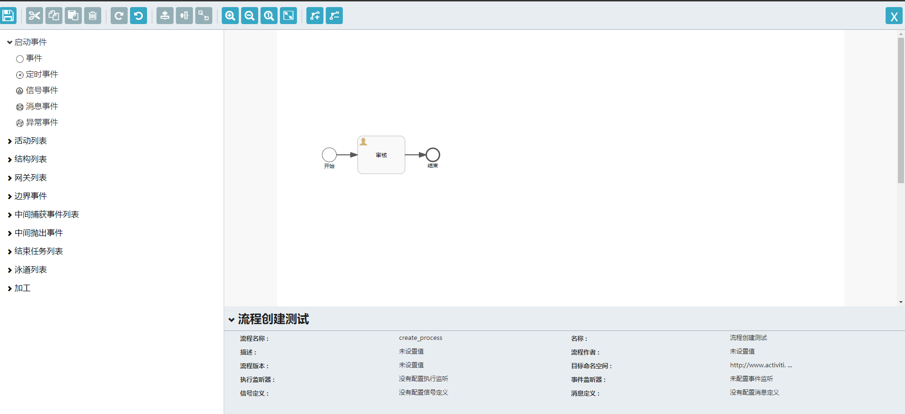

## SpringBoot2.4.4集成Activiti5.22在线流程设计器

> 通过查看官方文档发现从5.x版本以后源码包中无在线设计器资源包，本篇文章通过5.22版本实现，已经整合完成并有完整的流程案例可以参考我之前开源项目 [Activiti开源实战项目](https://gitee.com/sunny1009/sunny-activiti)

在整合在线设计器之前我们首先要整合activit框架，具体步骤如下

#### 1.整合Activiti工作流

- 创建SpringBoot项目并加入依赖

```xml
<dependency>
  <groupId>org.springframework.boot</groupId>
  <artifactId>spring-boot-starter-web</artifactId>
</dependency>
<dependency>
  <groupId>org.springframework.boot</groupId>
  <artifactId>spring-boot-starter-thymeleaf</artifactId>
</dependency>
<!--activiti-->
<dependency>
  <groupId>org.activiti</groupId>
  <artifactId>activiti-spring-boot-starter-basic</artifactId>
</dependency>
<!--mysql-->
<dependency>
  <groupId>mysql</groupId>
  <artifactId>mysql-connector-java</artifactId>
</dependency>
<!--mybatis-->
<dependency>
  <groupId>com.baomidou</groupId>
  <artifactId>mybatis-plus-boot-starter</artifactId>
</dependency>
```

- 在application.yml文件配置数据库和activit相关信息

```yml
spring:
  datasource:
    driver-class-name: com.mysql.cj.jdbc.Driver
    url: jdbc:mysql://127.0.0.1:3306/activiti-platform?characterEncoding=utf8&useSSL=false&serverTimezone=Asia/Shanghai&rewriteBatchedStatements=true&useAffectedRows=true&nullCatalogMeansCurrent=true
    username: root
    password: admin1009
    type: com.zaxxer.hikari.HikariDataSource
    hikari:
      maximum-pool-size: 50 # 连接池最大连接数，默认是10
      minimum-idle: 5 #最小空闲连接数量
      idle-timeout: 18000 #空闲连接存活最大时间，默认600000（10分钟）
      pool-name: ActivitiDesignHikariCP  #连接池名称
      connection-test-query: SELECT 1
  activiti:
    check-process-definitions: false #关闭验证自动部署,否则启动会报Error creating bean with name 'springProcessEngineConfiguration' defined in class path resource
```

- 启动类ActivitiDesignApplication增加排除安全校验注解

```java
@EnableAutoConfiguration(exclude = {org.activiti.spring.boot.SecurityAutoConfiguration.class,
        org.springframework.boot.autoconfigure.security.servlet.SecurityAutoConfiguration.class })
```


**通过上述两个步骤即可实现SpringBoot与activiti整合，启动项目无报错并且数据库已经初始化自动创建以ACT_开头的表说明整合完成**


#### 2.整合在线设计器

- 下载官网源码包，这里已经下载好了可以直接使用

[源码包下载](https://wws.lanzous.com/igExYnbv13e)

- 解压源码包，将activiti-explorer.war包下的diagram-viewer、editor-app文件夹拷贝到项目\resources\static文件下；将modeler.html拷贝到\resources\templates下；复制resources下stencilset.json到自己的resources下；将libs下的activiti-modeler-5.22.0-sources.jar解压出来，把org\activiti\rest\editor路径下的main、model文件夹复制到项目的controller包下面


- 引入maven依赖，这里涉及到页面跳转所以还需要引入静态模板资源thymeleaf的依赖

```xml
<!--流程图相关依赖-->
<dependency>
  <groupId>org.activiti</groupId>
  <artifactId>activiti-diagram-rest</artifactId>
</dependency>
<dependency>
  <groupId>org.activiti</groupId>
  <artifactId>activiti-modeler</artifactId>
</dependency>
<dependency>
  <groupId>org.springframework.boot</groupId>
  <artifactId>spring-boot-starter-thymeleaf</artifactId>
</dependency>
```

- 创建跳转页面的PageController

```java
@Controller
public class PageController {


    /**
     * @return java.lang.String
     * @Author sunt
     * @Description 跟路径跳转
     * @Date 2019/7/2 22:20
     * @Param [page]
     **/
    @GetMapping("/{page}")
    public String toPage(@PathVariable String page) {
        return page;
    }
    
}
```

至此基本整合完成，接下来需要调用activiti的相关API实现流程的增删该查等操作

#### 3.流程增删该查操作(ActivitiModelController)

- 创建流程操作，跳转到流程创建页面:http://127.0.0.1:8080/model/createModel

```java
@RequestMapping("/createModel")
    public void createModel(HttpServletRequest request, HttpServletResponse response) {
        try {
            ObjectMapper objectMapper = new ObjectMapper();
            ObjectNode editorNode = objectMapper.createObjectNode();
            editorNode.put("id", "canvas");
            editorNode.put("resourceId", "canvas");
            ObjectNode stencilSetNode = objectMapper.createObjectNode();
            stencilSetNode.put("namespace", "http://b3mn.org/stencilset/bpmn2.0#");
            editorNode.put("stencilset", stencilSetNode);
            Model modelData = repositoryService.newModel();

            ObjectNode modelObjectNode = objectMapper.createObjectNode();
            modelObjectNode.put(ModelDataJsonConstants.MODEL_NAME, "name");
            modelObjectNode.put(ModelDataJsonConstants.MODEL_REVISION, 1);
            modelObjectNode.put(ModelDataJsonConstants.MODEL_DESCRIPTION, "description");
            modelData.setMetaInfo(modelObjectNode.toString());
            modelData.setName("name");
            modelData.setKey(StringUtils.defaultString("key"));

            repositoryService.saveModel(modelData);
            repositoryService.addModelEditorSource(modelData.getId(), editorNode.toString().getBytes("utf-8"));

            request.setAttribute("modelId", modelData.getId());

            response.sendRedirect(request.getContextPath() + "/modeler.html?modelId=" + modelData.getId());
        } catch (Exception e) {
            log.error(e.getMessage(), e);
        }
    }
```


- 绘制流程图

> 一个完整的流程图必须要保证有开始节点和结束节点，每个流程的key要保证唯一不重复，流程节点之间的连线要保证连到位置




- 保存流程图,点击左上角保存即可

```java
@PutMapping(value = {"/{modelId}/save"})
    @ResponseStatus(HttpStatus.OK)
    public void saveModel(@PathVariable String modelId, @RequestParam("name") String name,
                          @RequestParam("json_xml") String json_xml, @RequestParam("svg_xml") String svg_xml,
                          @RequestParam("description") String description) {
        try {
            Model model = this.repositoryService.getModel(modelId);

            ObjectNode modelJson = (ObjectNode) this.objectMapper.readTree(model.getMetaInfo());

            modelJson.put("name", name);
            modelJson.put("description", description);
            model.setMetaInfo(modelJson.toString());
            model.setName(name);

            this.repositoryService.saveModel(model);

            this.repositoryService.addModelEditorSource(model.getId(), json_xml.getBytes("utf-8"));

            InputStream svgStream = new ByteArrayInputStream(svg_xml.getBytes("utf-8"));
            TranscoderInput input = new TranscoderInput(svgStream);

            PNGTranscoder transcoder = new PNGTranscoder();

            ByteArrayOutputStream outStream = new ByteArrayOutputStream();
            TranscoderOutput output = new TranscoderOutput(outStream);

            transcoder.transcode(input, output);
            byte[] result = outStream.toByteArray();
            this.repositoryService.addModelEditorSourceExtra(model.getId(), result);
            outStream.close();
        } catch (Exception e) {
            throw new ActivitiException("Error saving model", e);
        }
    }
```

保存成功act_ge_bytearray表会增加一条数据

- 流程列表查询http://127.0.0.1:8080/model/queryModelList

  ```java
  @RequestMapping("queryModelList")
      @ResponseBody
      public ResponseTableResult<List<Model>> queryModelList(HttpServletRequest request) {
          try {
              String page = request.getParameter("page");
              String limit = request.getParameter("limit");
              int pageNo = 1;
              int pageSize = 10;
              if (StrUtil.isNotBlank(page)) {
                  pageNo = Integer.valueOf(page);
              }
              if (StrUtil.isNotBlank(limit)) {
                  pageSize = Integer.valueOf(limit);
              }
              int firstResult = (pageNo - 1) * pageSize;
              long count = repositoryService.createModelQuery().count();
              List<Model> list = repositoryService.createModelQuery().orderByCreateTime().desc().listPage(firstResult, pageSize);
              return ResponseUtil.makeTableRsp(0, count, list);
          } catch (NumberFormatException e) {
              return ResponseUtil.makeTableRsp(ResultCode.FAIL.code,0,null);
          }
      }
  ```

  

- 删除流程

```java
 @RequestMapping("delModel")
    @ResponseBody
    public ResponseResult<String> delModel(HttpServletRequest request) {
        try {
            String modelId = request.getParameter("modelId");
            if(StrUtil.isBlank(modelId)) {
                return ResponseUtil.makeErrRsp(ResultCode.NOT_FOUND.code,"流程ID不存在!");
            }
            repositoryService.deleteModel(modelId);
            return ResponseUtil.makeOKRsp("删除流程成功!");
        } catch (Exception e) {
            e.printStackTrace();
            return ResponseUtil.makeErrRsp(ResultCode.FAIL.code,"系统异常:" + ExceptionUtil.getMessage(e));
        }
    }
```

- **部署流程，这里会增加一张流程定义业务表，部署成功将当前流程code保存下来，便于后期实际应用场景与流程进行关联**

```sql
CREATE TABLE `t_flow_def` (
  `DEF_ID` bigint(20) NOT NULL COMMENT '业务流程定义ID',
  `FLOW_CODE` varchar(50) NOT NULL COMMENT '流程编码(流程图的编码)',
  `FLOW_NAME` varchar(100) DEFAULT NULL COMMENT '流程名称',
  `FLOW_STATE` int(1) NOT NULL COMMENT '状态(0:启用 1:禁用)',
  PRIMARY KEY (`DEF_ID`)
) ENGINE=InnoDB DEFAULT CHARSET=utf8 COMMENT='流程定义表'

```

```java
 @RequestMapping("delModel")
    @ResponseBody
    public ResponseResult<String> delModel(HttpServletRequest request) {
        try {
            String modelId = request.getParameter("modelId");
            if(StrUtil.isBlank(modelId)) {
                return ResponseUtil.makeErrRsp(ResultCode.NOT_FOUND.code,"流程ID不存在!");
            }
            repositoryService.deleteModel(modelId);
            return ResponseUtil.makeOKRsp("删除流程成功!");
        } catch (Exception e) {
            e.printStackTrace();
            return ResponseUtil.makeErrRsp(ResultCode.FAIL.code,"系统异常:" + ExceptionUtil.getMessage(e));
        }
    }
```

部署成功会在ACT_RE_XXX表新增数据

到此流程相关的API已经整合完成，下一章节将增删该查操作以页面的形式展现出来进行操作

#### 4.总结

- SpringBoot与activiti的整合，进行数据库表的初始化操作，这部分需要引入依赖、配置application.yml、启动类排除安全验证、涉及到数据库操作需要引入mybatis相关依赖
- 整合在线设计器，下载源码将源码中的静态资源和jar包中的相关类拷贝到项目中
- 调用API进行流程的创建、删除、查询、部署等操作

#### 5.项目源代码地址 [项目源码](https://gitee.com/sunny1009/activiti-manaager)


