## SpringBoot整合Activiti项目实战

**本章节主要阐述实际业务如何嵌入工作流，具体的代码实现在下一章节**

> 上一章节我们已经实现了SpringBoot与Activiti在线设计器的整合，初步实现了通过在线设计器绘制流程以及流程的创建、保存、部署等操作，本章节只要借助一个实际员工在企业请假案例与工作流相结合实现基本的请假操作，简要的业务流程如下

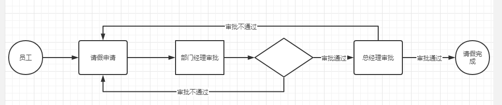

**需求:**

- 员工填写请假单→直属上级领导审批→审批通过→上级领导的上级领导审批→审批通过→请假完成
- 审批不通过需要员工重新修改申请单再次提交重新执行上述审批流程

> 这里只是简单的阐述一个最简单的请假流程，实际请假流程比这个复杂(例如:请假大于多少天的需要xxx审核，请假的类型:病假、事假、婚假、年假与薪资相结合等操作)

**具体实现步骤如下**

### 1.根据业务需求绘制对应的流程图

> 对绘制业务流程图这块我个人认为这块工作是开发者根据提出的业务需求绘制流程图而不应该交于开发者以外的人员

- 流程图绘制视频

[https://wws.lanzous.com/iWScFnzs1kh](https://wws.lanzous.com/iWScFnzs1kh)

密码:e1gc

**关于流程图的创建几点说明**

- 完整的流程图必须是一个闭合的，包含开始节点和结束节点

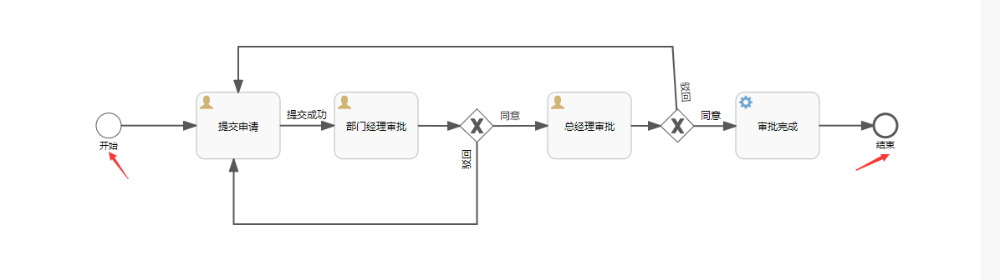

- 每个节点必须指定流程节点key且在一个流程中节点key是不能重复的

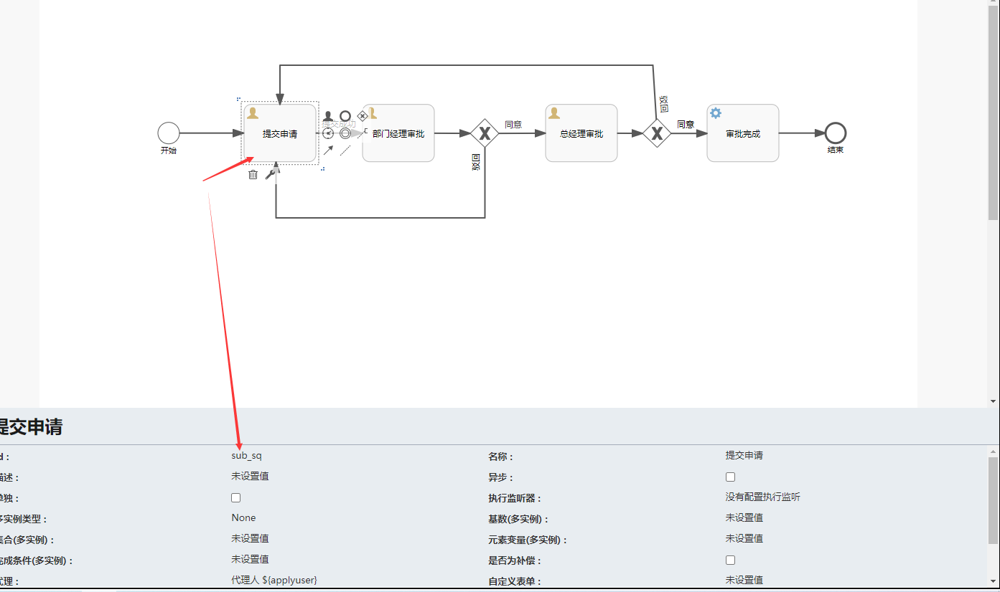

- 流程图画好，需要给整个流程指定名称，流程名称不能与现有的流程名重复

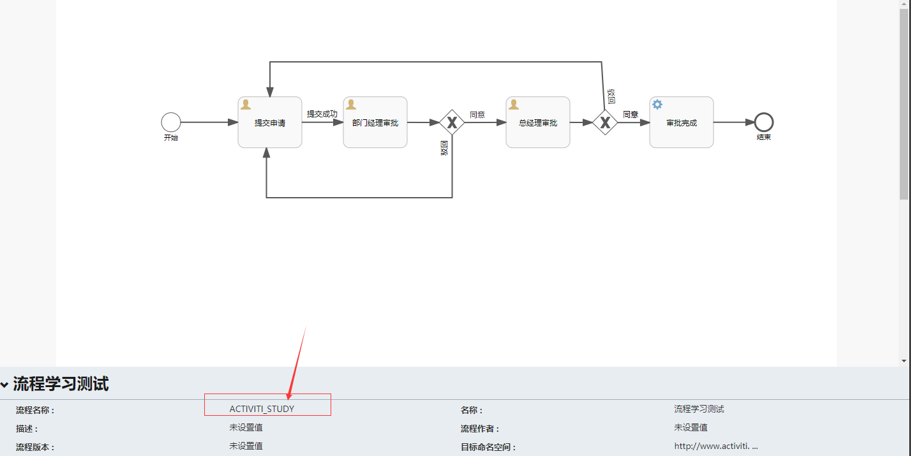

- 流程创建完之后需要部署流程，流程部署成功才算流程创建完成

### 2.匹配流程

> 针对业务场景不同的业务需求可能对应的流程不同，所以一个系统可能会绘制多个流程图，如何将业务与流程进行匹配，需要建立流程匹配规则；例如：针对请假申请不同的部门(销售部、研发部)不同的请假类型(婚假、事假)所涉及到的请假审批流程有差异，那么我们就可以根据这两个规则匹配不同的请假流程，这些规则信息(请假部门、请假类型)必须要在申请单里面携带。这里只是拿这两个规则进行举例，实际业务根据自己的业务进行扩展规则，例如：送外卖订单可以根据配送方式(上门取件、配送员配送)规则、电商网站根据不同渠道来源(微信、支付宝、淘宝、京东)销售的商品进行佣金结算都可以作为一个流程的规则

- 创建流程定义表

这个表在流程部署成功之后将流程编码保存下来建立关联关系

```sql
CREATE TABLE `t_flow_def` (
  `DEF_ID` bigint(20) NOT NULL COMMENT '业务流程定义ID',
  `FLOW_CODE` varchar(50) NOT NULL COMMENT '流程编码(流程图的编码)',
  `FLOW_NAME` varchar(100) DEFAULT NULL COMMENT '流程名称',
  `FLOW_STATE` int(1) NOT NULL COMMENT '状态(0:启用 1:禁用)',
  PRIMARY KEY (`DEF_ID`)
) ENGINE=InnoDB DEFAULT CHARSET=utf8 COMMENT='流程定义表'

```

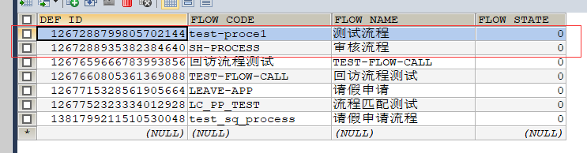

- 创建流程规则

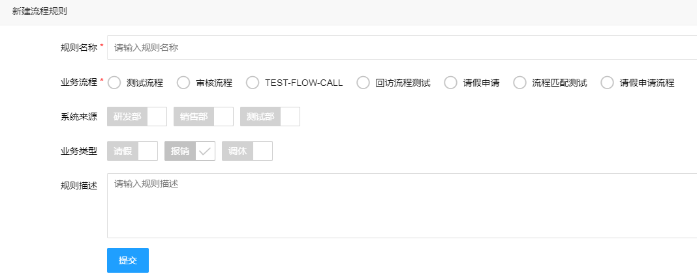

这个表主要就是针对业务进行规则的扩展，最后将规则与流程定义表的流程定义ID进行关联这样就可以匹配到对应的流程

```sql
CREATE TABLE `t_flow_rule` (
  `RULE_ID` bigint(20) NOT NULL COMMENT '规则ID',
  `DEF_ID` bigint(20) DEFAULT NULL COMMENT '业务流程定义ID',
  `SYSTEM_CODE` varchar(200) NOT NULL COMMENT '系统来源',
  `BUSI_TYPE` varchar(200) NOT NULL COMMENT '业务类型',
  `RULE_NAME` varchar(100) NOT NULL COMMENT '规则名称',
  `RULE_DESC` varchar(200) DEFAULT NULL COMMENT '规则描述',
  PRIMARY KEY (`RULE_ID`)
) ENGINE=InnoDB DEFAULT CHARSET=utf8 COMMENT='流程规则表'

```

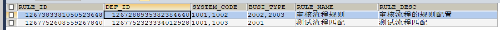

- 请假业务与流程匹配原理

**A.确保已经配置流程规则，根据不同的规则匹配不同的流程**

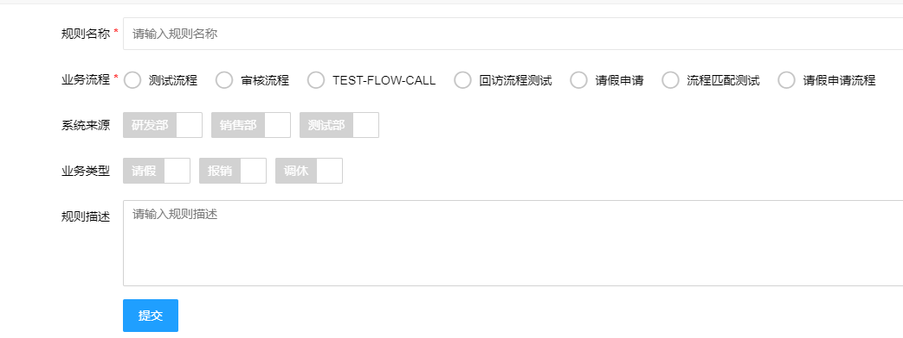

**B.填写的请假单必须要有规则字段**

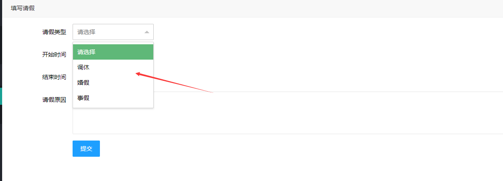

**C.提交申请，匹配流程**

这一步骤提交申请需要首先去匹配流程，其次根据匹配到的流程启动工作流

- 首先查看工作流框架启动流程的API

```java
ProcessInstance startProcessInstanceByKey(String processDefinitionKey, String businessKey, Map<String, Object> variables);
```

需要三个参数才能启动流程：**processDefinitionKey**流程编码就是我们创建流程的时候自定义的编码，此编码对应保存在流程定义表，建立流程规则的时候又关联了流程定义ID，那么流程匹配的时候自然能找到这个编码

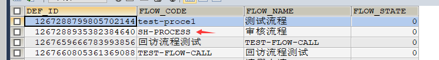

**businessKey**：业务key，这个就是我们业务对应的唯一key，自动生成不重复即可，只要启动一个流程就生成一个业务key与审批单管理保存即可，到这里我们还得创建一张表保存流程与申请单关联关系的表

```sql
CREATE TABLE `tf_flow_main` (
  `FLOW_INST_ID` bigint(32) NOT NULL COMMENT '主键',
  `ORDER_NO` bigint(32) DEFAULT NULL COMMENT '审批单号',
  `FLOW_DEF_ID` varchar(50) DEFAULT NULL COMMENT '流程定义编码(创建流程时设置的)',
  `FLOW_ID` bigint(32) DEFAULT NULL COMMENT '流程ID(启动流程时生成的编码)',
  `RULE_ID` bigint(32) DEFAULT NULL COMMENT '流程规则ID',
  `FLOW_STATE` int(1) DEFAULT NULL COMMENT '流程状态(1:正常,0:异常)',
  `CREATE_TIME` datetime DEFAULT NULL COMMENT '流程启用时间',
  PRIMARY KEY (`FLOW_INST_ID`)
) ENGINE=InnoDB DEFAULT CHARSET=utf8 COMMENT='流程与审批单表关联表'

```

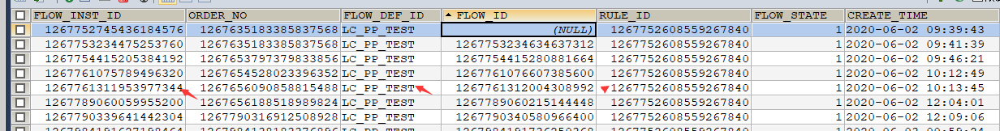

**variables:**流程变量这个与我们创建流程的时候指定的变量保持一致即可，例如审批通过我们配置的表达式：${spState=='agree'}，那么代码中将此变量赋值以形参的方式传递

```java
variables.put("spState","agree");
```

- **其次匹配流程的方法**

> 这里写一些简短的伪代码查看，详细代码在下一章节项目查看

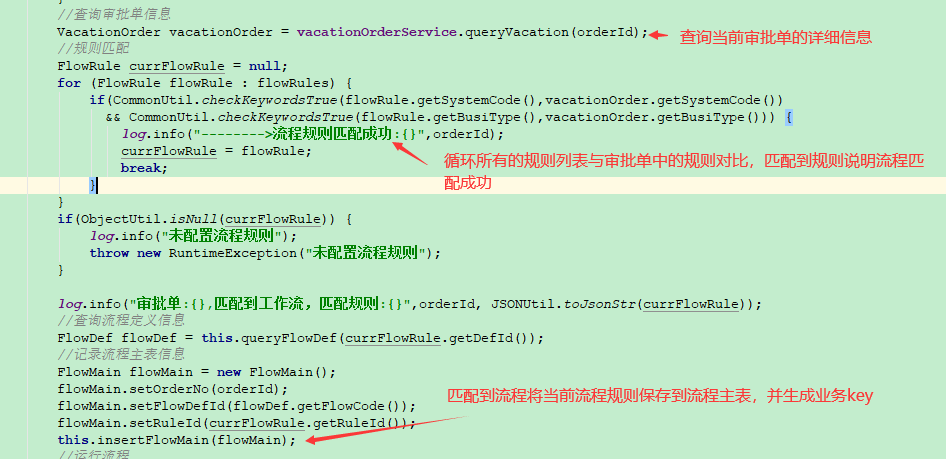

- **最后启动流程**

  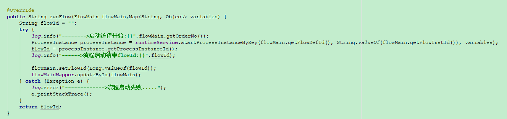

### 3.总结

- 根据业务需求绘制并部署流程图(保存流程编码到T_FLOW_DEF表)

- 根据业务场景抽取公共业务作为流程规则配置(将规则与流程定义编码进行关联)

- 业务提交申请成功，匹配流程并启动流程

- 在业务提交环节可以根据业务需求增加流程的审批记录日志操作信息

  