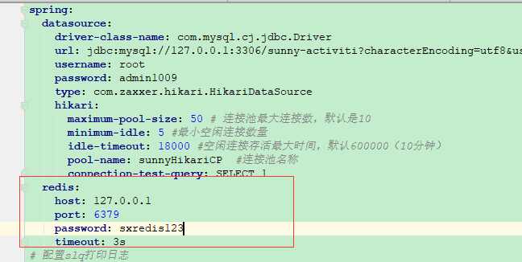

## SunnyActiviti项目解读

> 上面两个章节已经讲解了SpringBoot如何集成Activiti在线编辑器以及Activit的应用场景和基本原理，本章节主要针对项目进行解读，包括项目框架 的搭建以及核心功能对应代码的讲解(代码只贴部分核心代码，详细代码对照项目查看)

### 1.项目框架搭建

> 前提是自己创建SpringBoot项目

#### 整合前端框架

> 本项目前端框架使用Thymeleaf 模板引擎,Thymeleaf 是一个优秀的、面向Java 的XML庆HTML/HTML5 页面模板，具有丰
> 富的标签语言和函数。因此，在使用Spring Boot 框架进行页面设计时， 一般都会选择Thymeleaf 模板

- pom.xml文件引入依赖

```xml
<dependency>
  <groupId>org.springframework.boot</groupId>
  <artifactId>spring-boot-starter-web</artifactId>
</dependency>
<dependency>
   <groupId>org.springframework.boot</groupId>
   <artifactId>spring-boot-starter-thymeleaf</artifactId>
</dependency>
```

- 配置文件针对thymleaf配置

```yml
spring:
  thymeleaf:
    mode: LEGACYHTML5 #声明为非严格的HTML5格式
    cache: false
```

- 创建页面跳转公共Controller - PageController.java

> 访问Controller路径会跳转到对应：resources/templates对应目录下对应的html


#### 整合数据访问层

> 数据库采用MySQL5.7+版本，操作数据库框架用Mybatis-Plus，官方地址:[https://mp.baomidou.com/guide/](https://mp.baomidou.com/guide/)

- pom.xml文件引入依赖

```xml
<dependency>
  <groupId>mysql</groupId>
  <artifactId>mysql-connector-java</artifactId>
  <scope>runtime</scope>
</dependency>
<dependency>
  <groupId>com.baomidou</groupId>
  <artifactId>mybatis-plus-boot-starter</artifactId>
  <version>3.3.1</version>
</dependency>
```

- 配置文件配置数据库连接信息

```yml
spring:
  datasource:
    driver-class-name: com.mysql.cj.jdbc.Driver
    url: jdbc:mysql://127.0.0.1:3306/sunny-activiti?characterEncoding=utf8&useSSL=false&serverTimezone=Asia/Shanghai&rewriteBatchedStatements=true&useAffectedRows=true&nullCatalogMeansCurrent=true
    username: root
    password: admin1009
    type: com.zaxxer.hikari.HikariDataSource
    hikari:
      maximum-pool-size: 50 # 连接池最大连接数，默认是10
      minimum-idle: 5 #最小空闲连接数量
      idle-timeout: 18000 #空闲连接存活最大时间，默认600000（10分钟）
      pool-name: sunnyHikariCP  #连接池名称
      connection-test-query: SELECT 1
# 配置slq打印日志
mybatis-plus:
  configuration:
    log-impl: org.apache.ibatis.logging.stdout.StdOutImpl
  mapper-locations: classpath*:/mapper/**/*.xml
```

- Mybatis-Plus的配置

```java
@EnableTransactionManagement
@Configuration
@MapperScan("com.sunny.activiti.mapper")
public class MybatisPlusConfig {

    @Bean
    public PaginationInterceptor paginationInterceptor() {
        PaginationInterceptor paginationInterceptor = new PaginationInterceptor();
        paginationInterceptor.setCountSqlParser(new JsqlParserCountOptimize(true));
        return paginationInterceptor;
    }
}
```

- 创建Controller→Service→Mapper→实体Bean验证是否可以实现数据库操作

> 这里以SYS_USER表为例进行验证，对应的实体Bean：User.java ,自己创建Controoler调用UserServiceImpl对应的queryUserById方法通过postMan发送请求验证是否可以查询到数据，如果可以查询到说明整合Mybatis-Plus完成

```java
 @Override
    public User queryUserById(String userId) {
        QueryWrapper<User> queryWrapper = new QueryWrapper<>();
        queryWrapper.eq("USER_ID",userId);
        return userMapper.selectOne(queryWrapper);
    }
```

#### 整合Activiti框架

- pom.xml文件引入依赖

> 如果不需要集成actriviti在线设计器的后面两个pom就不需要引入

```xml
<!-- Activiti启动器 需要排除mybatis依赖 -->
<dependency>
  <groupId>org.activiti</groupId>
  <artifactId>activiti-spring-boot-starter-basic</artifactId>
  <version>5.22.0</version>
  <exclusions>
    <exclusion>
      <groupId>org.mybatis</groupId>
      <artifactId>mybatis</artifactId>
    </exclusion>
  </exclusions>
</dependency>
<!-- Activiti流程图 -->
<dependency>
  <groupId>org.activiti</groupId>
  <artifactId>activiti-diagram-rest</artifactId>
  <version>5.22.0</version>
</dependency>
<!-- Activiti在线设计器 -->
<dependency>
  <groupId>org.activiti</groupId>
  <artifactId>activiti-modeler</artifactId>
  <version>5.22.0</version>
</dependency>
```

- 启动类安全验证配置

  

- 验证结果

启动项目如果不报错数据库里面会自动创建ACT_开头的表说明集成Activiti成功

#### 集成Redis缓存

- pom.xml文件引入依赖

```xml
<dependency>
  <groupId>org.springframework.boot</groupId>
  <artifactId>spring-boot-starter-data-redis</artifactId>
</dependency>
```

- 配置redis连接信息



- 创建缓存服务CacheServiceImpl，在需要使用到缓存的地方@Autowired注入即可

```java
@Service
public class CacheServiceImpl implements ICacheService {

    @Autowired
    private StringRedisTemplate stringRedisTemplate;

    @Resource
    private RedisTemplate<String, Object> redisTemplate;

    @Override
    public void cacheStringData(String cacheKey, String cacheValue, long timeout) {
        stringRedisTemplate.opsForValue().set(cacheKey, cacheValue,timeout, TimeUnit.MINUTES);//分钟过期
    }

    @Override
    public String getCacheInfoByCode(String cacheKey) {
        return stringRedisTemplate.opsForValue().get(cacheKey);
    }

    @Override
    public void cacheObjData(String cacheKey, Object cacheValue, long timeout) {
        redisTemplate.opsForValue().set(cacheKey, cacheValue, timeout, TimeUnit.MINUTES);
    }

    @Override
    public Object getObjCacheByCode(String cacheKey) {
        return redisTemplate.opsForValue().get(cacheKey);
    }

    @Override
    public boolean delCacheByCode(String cacheKey) {
        return redisTemplate.delete(cacheKey);
    }
}
```

- 自己可以创建Controller调用缓存服务向缓存中保存数据和从缓存获取数据，登录redis客户端查看数据进行验证

### 2.登录功能

> 实现原理:基于用户名+密码+验证码的方式校验通过，生成唯一token保存到cookie,将token作为缓存的key，值为用户信息保存到Redis缓存

#### 验证码实现

> 本项目未做实现，这里将原理和部分代码贴出来，自己可以实现，也可以参考我的开源博客项目
>
> [https://gitee.com/sunny1009/sunny-blog](https://gitee.com/sunny1009/sunny-blog)

- 实现原理

​         后端生成验证码(文字、数字、文字加数字等)以图片的形式返回到前端展示，后端生成验证码的同时生成唯一不重复的key，将此作为缓存key，对应缓存的值为生成的验证码保存到缓存服务，并设置缓存key的过期时间，同时将key和验证码返回到前端。前端登录验证的时候将key和前端输入框输入的验证码传递到后端，后端拿到key去缓存查询验证码是否存在，如果存在拿到缓存中的验证码与用户输入的验证码进行对比，缓存中不存在提示验证码失效(当然这里的弊端缓存down机会导致应用无法使用，感兴趣的自己可以上网查询一些优化方案)

**具体实现步骤如下:**

- 引入第三方pom依赖

```xml
<dependency>
  <groupId>com.github.whvcse</groupId>
  <artifactId>easy-captcha</artifactId>
  <version>1.6.2</version>
</dependency>
```

- controller创建生成验证码方法

> 这里保存到缓存的实现逻辑需要自己稍作修改，大量用户同时访问获取验证码会出现验证码校验有一定几率出现错误情况

```java
@GetMapping(value = "/genVerifyCode", produces = MediaType.IMAGE_PNG_VALUE)
    public void genVerifyCode(HttpServletResponse response) throws IOException {
        try {
            // 设置请求头为输出图片类型,github地址:https://gitee.com/whvse/EasyCaptcha
            response.setContentType(MediaType.IMAGE_PNG_VALUE);
            response.setHeader("Pragma", "No-cache");
            response.setHeader("Cache-Control", "no-cache");
            response.setDateHeader("Expires", 0L);
            // 三个参数分别为宽、高、位数
            SpecCaptcha specCaptcha = new SpecCaptcha(130, 48, 5);
            String verifyCode = specCaptcha.text();
            log.info("---------->随机生成的验证码:" + verifyCode);
            String cacheCode = cacheService.getCacheInfoByCode(verifyCode);
            if(StrUtil.isNotBlank(cacheCode)) {
                log.info("缓存中检索到重复key:" + verifyCode + ",对应到缓存中的验证码:" + cacheCode);
            }else {
                log.info("-------->输出图片验证码到浏览器");
                cacheService.cacheStringData(verifyCode.toUpperCase(),verifyCode,1);
                specCaptcha.out(response.getOutputStream());
            }
        } catch (Exception e) {
            log.error("获取验证码异常:" + e.getMessage());
        }
    }
```

- 前端页面展示验证码


#### 登录实现

- 实现原理

​       根据输入的用户名查询用户是否存在，如果存在获取到对应的密码，然后将获取到的密码进行加密跟数据库的密码进行比对操作，比对通过生成唯一token保存到cookie，将token作为缓存的key,缓存值为查询到的用户信息保存到缓存服务，后期涉及到登录接口需要携带此token到缓存查询用户信息，查询到说明登录信息有效(**这里只是最基本的用户名和密码匹配登录认证，实际业务场景的登录比这个复杂的多，按照实际业务场景和需求实现**)

- 登录代码(UserInfoController)

> 调用service和mapper等操作自己对照代码查看，后期的讲解都是只贴一个入口代码，其余实现自己下载项目跟踪代码自行查看

```java
@PostMapping("/login")
    public ResponseResult<User> doLogin(@RequestBody User user, HttpServletResponse response) {
        ResponseResult<User> userResponseResult = userService.doLogin(user.getUserName(), user.getUserPass());

        String token = IdUtil.fastSimpleUUID();
        ServletUtil.addCookie(response, SysConstant.ACTIVITI_COOKIE, token,-1); //关闭浏览器登录失效
        cacheService.cacheObjData(token,userResponseResult.getData(), 60);
        return userResponseResult;
    }
```

- 前端代码

对应login.html传递账号和密码调用后端接口，登录成功进入首页

### 3.首页框架

首页框架使用的第三方开源框架实现，官网地址：[http://layuimini.99php.cn/docs/](http://layuimini.99php.cn/docs/)

- 前端页面(index.html)

进入首页调用后端初始化菜单，本项目未做权限控制，实际业务场景会针对不同的用户做权限控制

- 后端查询菜单(IndexController)

```java
 @RequestMapping("queryMenu")
    public Map<String, Object> queryMenu() {
        Map<String, Object> map = systemService.queryMenuList();
        return map;
    }
```

### 4.Activiti框架具体配置

#### 流程图乱码和ID生成策略配置

```java
@Configuration
public class ActivitiConfig {

    @Autowired
    private PlatformTransactionManager transactionManager;
    @Autowired
    private HikariDataSource hikariDataSource;

    @Autowired
    private ActivitiIdGenerate activitiIdGenerate;

    @Bean
    public ProcessEngineConfigurationImpl getProcessEngineConfiguration(ProcessEngineConfigurationImpl processEngineConfiguration) {

        //id生成策略
       processEngineConfiguration.setIdGenerator(activitiIdGenerate);
        //设置DbSqlSessionFactory的uuidGenerator，否则流程id，任务id，实例id依然是用DbIdGenerator生成
        processEngineConfiguration.getDbSqlSessionFactory().setIdGenerator(activitiIdGenerate);
        //设置流程图片中文乱码
        processEngineConfiguration.setActivityFontName("宋体");
        processEngineConfiguration.setLabelFontName("宋体");
        processEngineConfiguration.setAnnotationFontName("宋体");
      //  processEngineConfiguration.setEnableDatabaseEventLogging(true);
        return processEngineConfiguration;
    }

    @Bean
    public SpringProcessEngineConfiguration processEngineConfiguration(DataSource dataSource, PlatformTransactionManager manager){
        SpringProcessEngineConfiguration configuration =  new SpringProcessEngineConfiguration();
        configuration.setDataSource(dataSource);
        configuration.setTransactionManager(manager);
        configuration.setAsyncExecutorActivate(true);
        configuration.setHistoryLevel(HistoryLevel.FULL);
        configuration.setDatabaseSchema("activity");
        configuration.setDbHistoryUsed(true);
        configuration.setDatabaseSchemaUpdate("true");
        configuration.setEnableDatabaseEventLogging(true); //是否开启dblog
        return configuration;
    }
}
```

#### 流程图各个节点状态连线控制

> 这部分代码根据自己的能力查看即可，不感兴趣的直接拷贝到自己的项目即可


### 5.请假审批流程

#### 实现原理


