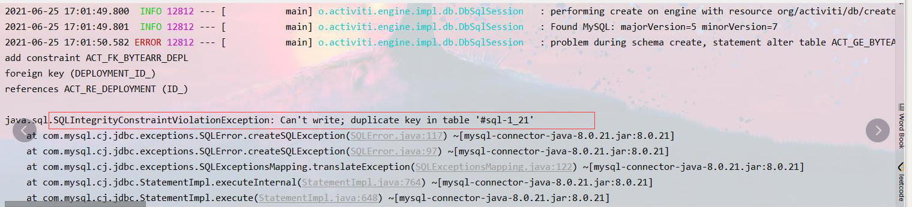

## SunnyActiviti项目的安装与配置
### 1.基础环境的配置
- JDK1.8+的安装与配置

参考文档: 

[https://www.cnblogs.com/nojacky/p/9497724.html](https://www.cnblogs.com/nojacky/p/9497724.html)

[https://www.cnblogs.com/sunny1009/p/11969065.html](https://www.cnblogs.com/sunny1009/p/11969065.html)

- MySQL5.7+的安装与配置

**特别重要: 使用sunny-activiti的项目MySQL数据库必须设置忽略大小写配置**

忽略带下写参考文章:[https://www.jianshu.com/p/9ff5c50ed7c7](https://www.jianshu.com/p/9ff5c50ed7c7)

安装参考文章:

[https://blog.csdn.net/shenkeding9350/article/details/84889562](https://blog.csdn.net/shenkeding9350/article/details/84889562)

[https://www.cnblogs.com/sunny1009/p/11969238.html](https://www.cnblogs.com/sunny1009/p/11969238.html)

- Redis的安装与配置

**使用sunny-activiti的项目必须开启Redis的访问密码**

参考文章:

[https://www.cnblogs.com/sunny1009/articles/7866034.html](https://www.cnblogs.com/sunny1009/articles/7866034.html)

windows直接解压使用:

```shell
下载:https://wwa.lanzoui.com/iWct1qrkt9g 密码:9mas
```

- maven的安装与配置

参考文章: [https://blog.csdn.net/a805814077/article/details/100545928](https://blog.csdn.net/a805814077/article/details/100545928)

### 2.导入MySQL脚本

> 脚本获取按照QQ群(534073451)文件说明获取

- 创建数据库，并设置字符集为UTF8
- 导入SQL脚本，务必忽略MySQL数据库大小写，不然后期会出现各种莫名其妙问题

### 3.配置项目并启动

> 本项目按照前面每一步骤的操作之后，就可以实现请假单的填写、审批工作，如果有新的业务流程需要自己重新绘制工作流重新开发，本项目只是拿最简单的请假业务做的简单讲解

- 克隆项目 [https://gitee.com/sunny1009/sunny-blog.git](https://gitee.com/sunny1009/sunny-blog.git)
- 修改配置文件: 数据库的连接信息、Redis的连接信息(密码设置)
- 启动项目浏览器访问: http://127.0.0.1:8080
- 登录系统

| 用户名   | 密码 | 级别                                 |
| -------- | ---- | ------------------------------------ |
| sunqi    | 123  | 程序员                               |
| zhaoliu  | 123  | 程序员                               |
| wangwu   | 123  | 项目经理(程序员的直接上级领导)       |
| zhangsan | 123  | 主管(项目经理上级领导，公司最高领导) |

> 这里简单说明一下: zhangsan属于最高领导，本项目的业务最高领导不用请假，所以登录zhangsan的工号填写请假会报错，这个每个场景按自己需求改变即可，本项目只是以一个案例讲解工作流与实际业务结合，拒绝吐槽xxx为啥不能使用，xxx功能为什么没做实现

#### 4.项目功能

- 登录功能: 用户名+密码登录，验证码页面预留，未做实现，感兴趣的自己实现
- 页面菜单权限管控未做实现，本项目只要是讲解业务与工作流如何使用的
- 请假单填写、修改已经实现
- 流程的新建、编辑、部署工作已经实现
- 流程规则的配置已经实现
- 流程审批功能、回退功能已经实现

### 5.常见问题

- 项目登录账户、密码、启动端口问题： ***查看项目文档***
- 启动报错： ***MySQL未忽略大小写、MySQL版本低于5.7***




