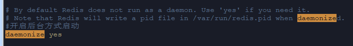

### Linux下Redis的安装并设置密码

### 1.安装gcc依赖

- 安装之前查看是否已经安装gcc依赖

```shell
rpm -qa |grep gcc
```


- 如果上一步执行未安装需要执行如下命令安装gcc依赖,提示安装按键盘Y确认即可

```shell
yum install gcc
```

#### 2.下载安装包并上传到服务器

- 官网下载地址：[https://redis.io/download](https://redis.io/download)
- 已经下载好的安装包:[https://wwa.lanzoui.com/iQezupo39ef](https://wwa.lanzoui.com/iQezupo39ef)

#### 3.解压安装包到当前目录

```shell
tar -xvf redis-3.2.9.tar.gz 
```

#### 4.编译并安装到指定目录下

```shell
cd redis-3.2.9
make
cd src
make install PREFIX=/home/o2o_order/soft/redis
```

#### 4.进入到解压目录将redis.conf移到redis的安装目录下

```shell
mv redis.conf /home/o2o_order/soft/redis 
```

#### 5.进入redis的安装目录修改配置信息

- 设置redis后台方式启动:将daemonize的值改为yes



- 开启Redis的密码访问:requirepass 设置的密码


#### 5.启动redis

进入到redis的安装目录执行如下命令进去启动

```shell
./bin/redis-server redis.conf
```

#### 6.测试redis客户端连接

- 启动客户端

```shell
./bin/redis-cli
```


- 输入密码登录


- Redis常用命令测试

