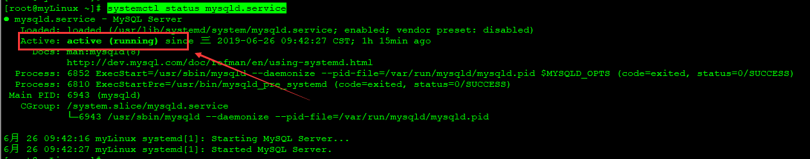
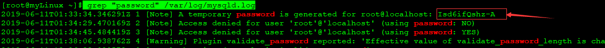
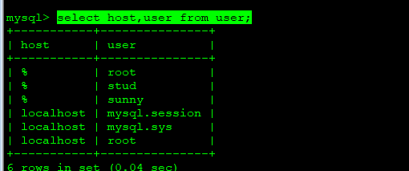

### Centos7以yum方式安装MySQL


#### 1.下载安装源

```shell
wget -i -c http://dev.mysql.com/get/mysql57-community-release-el7-10.noarch.rpm
```

#### 2.yum方式安装

```shell
yum -y install mysql57-community-release-el7-10.noarch.rpm
```

#### 3.安装MySQL服务

```shell
yum -y install mysql-community-server
```

#### 4.数据库具体配置

- 启动MySQL服务

```shell
systemctl start  mysqld.service
```

- 查看MySQL状态

```shell
systemctl status mysqld.service
```



- 查看MySQL初始密码

> 通过日志内容可以查看到默认初始密码

```shell
grep "password" /var/log/mysqld.log
```



- 登录MySQL修改默认密码

```shell
mysql -u root -p 默认密码
use mysql;
SHOW VARIABLES LIKE 'validate_password%'; 
#设置密码策略为简单
set global validate_password_policy=LOW;
#修改密码
ALTER USER 'root'@'localhost' IDENTIFIED BY '新密码';
```

- 关闭yum自动更新

```shell
yum -y remove mysql57-community-release-el7-10.noarch
```

- MySQL配置文件

```shell
/etc/my.cnf
```

#### 5.设置连接权限

- 开启root远程访问权限(生产环境不推荐)

```shell
PRIVILEGES ON *.* TO 'root'@'%' IDENTIFIED BY 'admin@1009' WITH GRANT OPTION;
```

- 刷新再次查看权限

```shell
flush privileges; 
select host,user from user;
```

> root前面%代表所有ip均可连接



- 指定指定的IP允许连接

```shell
GRANT ALL ON *.* to root@'123.138.78.146' IDENTIFIED BY 'Wang251314.'; 
FLUSH PRIVILEGES;
```

#### 6.创建用户及开通权限

```shell
CREATE USER 'username'@'host' IDENTIFIED BY 'password';
```

- 创建用户名：sunny,密码：Sunny@123允许所有主机登录

```shell
CREATE USER 'sunny'@'%' IDENTIFIED BY 'Sunny@123';
```

- 授权基本语法

```shell
GRANT privileges ON databasename.tablename TO 'username'@'host'
```

```shell
privileges用户可操作的权限，包括(select,delete,update,insert),如果要为创建的用户开通所有权限指定为all即可

databasename数据库名，指定用户可操作那个数据库

tablesname:表名称，指定用户可操作那个表
```

- 为新用户开通所有权限

```shell
GRANT ALL ON *.* TO 'sunny'@'%';
```

- 为用户开通操作指定数据库权限

```shell
GRANT ALL ON study.* TO 'sunny'@'%';
```

- 为用户开通指定操作表的权限

```shell
GRANT SELECT ON study.cnarea_2018 TO 'sunny'@'%';
```

