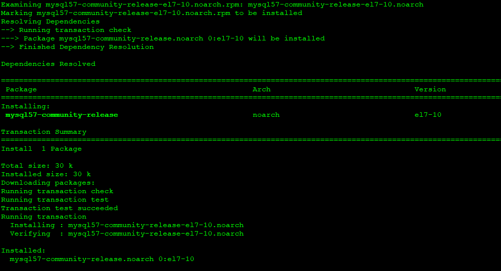
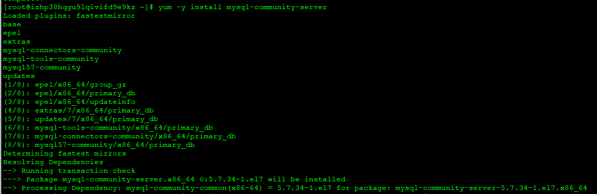
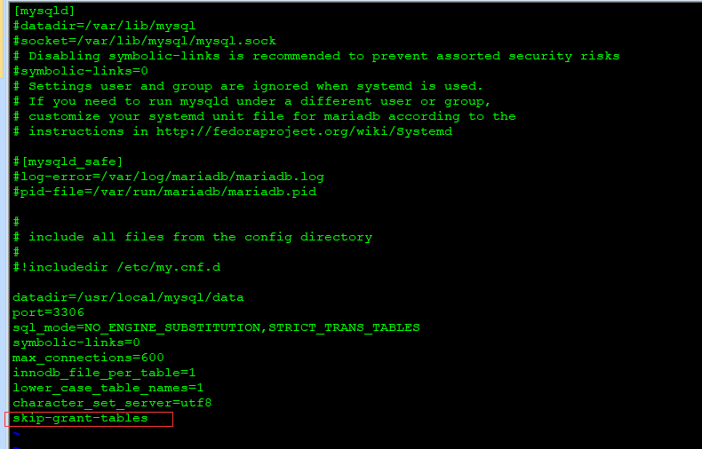
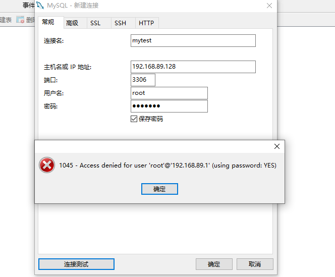
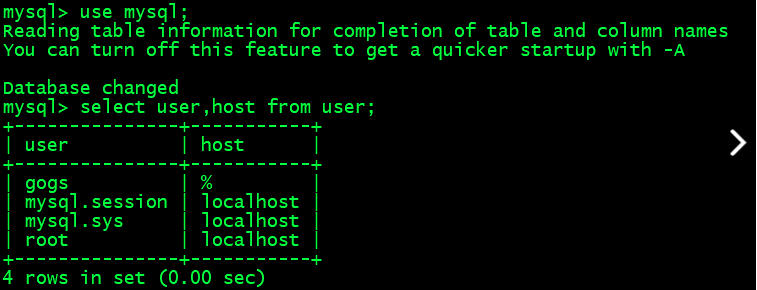

### Linux下MySQL的安装与密码设置

#### 1.下载并安装yum repository

```shell
wget -i -c http://dev.mysql.com/get/mysql57-community-release-el7-10.noarch.rpm
yum -y install mysql57-community-release-el7-10.noarch.rpm
```



#### 2.安装MySQL服务

```shell
yum -y install mysql-community-server
```



#### 3.MySQL服务的启动与停止命令

- 启动服务

```shell
systemctl start mysqld.service
```

- 查看服务状态

```shell
systemctl status mysqld.service
```

- 停止服务

```shell
systemctl stop mysqld.service
```

- 重启服务

```shell
systemctl restart mysqld.service
```

#### 4.修改MySQL密码

> MySQL默认安装一般是直接可以登录的，如果无法直接登录需要修改MySQL启动时不验证密码

- 配置MySQL启动时不校验密码，在配置文件添加一行skip-grant-tables

```shell
 vi /etc/my.cnf
```



- 登录MySQL，切换到mysql数据库，更新user表

> 在之前的版本中，密码字段的字段名是 password，5.7版本改为了 authentication_string

```sql
mysql -u root -p
use mysql;
update user set authentication_string = password('设置密码'), password_expired = 'N', password_last_changed = now() where user = 'root';
```

- 退出 mysql，编辑 /etc/my.cnf 文件，删除 skip-grant-tables=1 的内容
- 重启 mysqld 服务，再用新密码登录即可

#### 5.开启MySQL远程访问

> 一般在服务器上直接可以登录MySQL，在客户端测试远程ip和端口都是开放的，但是登录就报错，这种一般是MySQL没有授权远程访问导致的



- 登录MySQL查看user表的host字段

```shell
use mysql;
select user,host from user;
```

> host字段中，localhost表示只允许本机访问，要实现远程连接，可以将root用户的host改为%，%表示允许任意host访问，如果需要设置只允许特定ip访问，则应改为对应的ip。



- 修改host远程访问,并刷新权限

```shell
update user set host="%" where user="root";
flush privileges;
```

